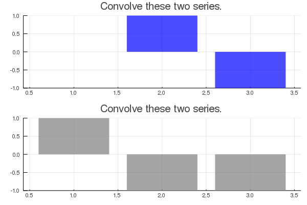
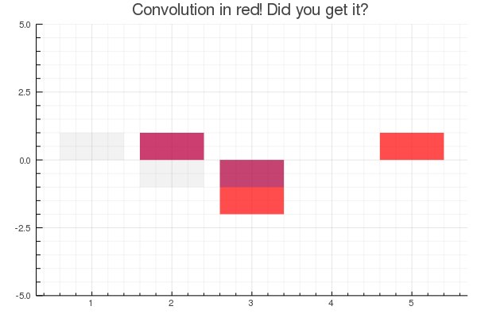

# Grokking Convolution Sums Flashcard Generator
 I'm sick and tired of constantly forgetting everything I know about convolutions!

Basically, all this does is generate sets of two series, and then asks you to convolve them. The numbers are easy so that you can do it in your head. These were made for flash cards on Quizlet.

I kept forgetting how to visualize convolutions "directly", hence this code. 🙂
